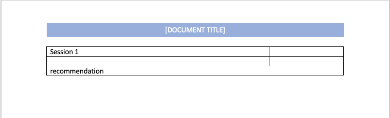
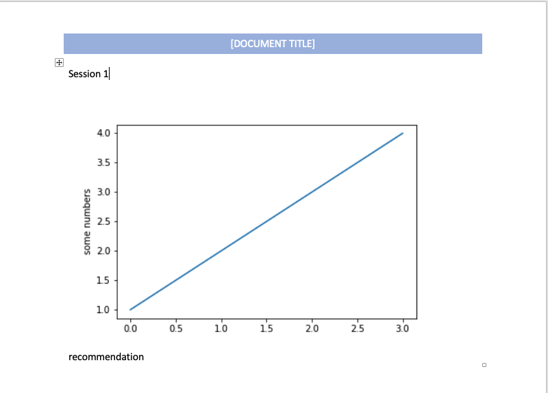

# Populate a template docx file using python-docx

## Steps:
- Create template file, using tables to layout (see example)
- Run the scipt
- Open the output file and remove the border of table

## Snapshots
### Input

### Output
